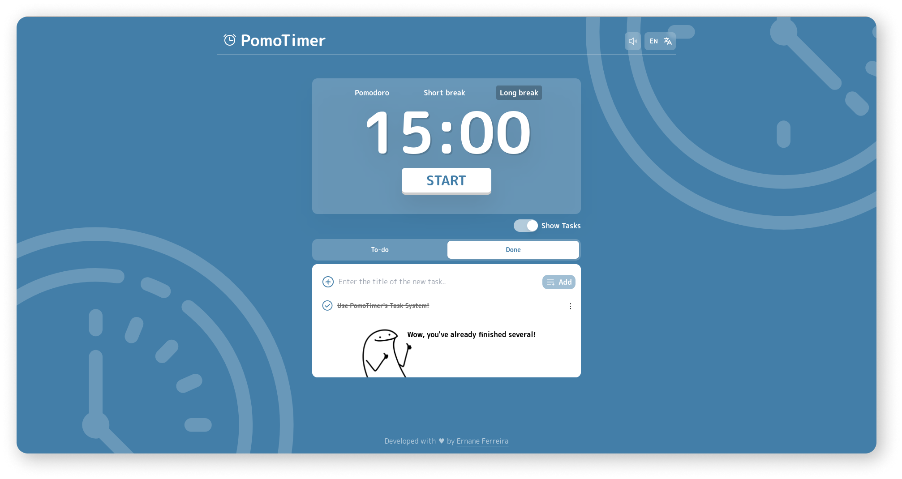

<h1 align="center">
  <strong>⏰ PomoTimer ⏰</strong>
</h1>

<p align="center">
  <a href="#-technologies">Technologies</a>&nbsp;&nbsp;&nbsp;|&nbsp;&nbsp;&nbsp;
  <a href="#-project">Project</a>&nbsp;&nbsp;&nbsp;|&nbsp;&nbsp;&nbsp;
  <a href="#-features">features</a>&nbsp;&nbsp;&nbsp;|&nbsp;&nbsp;&nbsp;
  <a href="#-tests">tests</a>&nbsp;&nbsp;&nbsp;|&nbsp;&nbsp;&nbsp;
  <a href="#-contribute">Contribute</a>&nbsp;&nbsp;&nbsp;|&nbsp;&nbsp;&nbsp;
  <a href="#-license">License</a>&nbsp;&nbsp;&nbsp;
</p>

<br/>

<p align="center">
  <a href="https://github.com/ErnaneJ/PomoTimer/actions/workflows/node.js.yml"></a>
  <a href="https://opensource.org/licenses/MIT"></a>
</p>

<p align="center">
  
</p>

## 🚀 Technologies

This project was developed with the following technologies:

- [Typescript](https://www.typescriptlang.org/)
- [React](https://reactjs.org/)
  - [Headless Ui](https://headlessui.dev/)
  - [Tailwind CSS](https://tailwindcss.com/)
  - [Phosphor Icons](https://phosphoricons.com/)
  - [Styled Components](https://styled-components.com/)

## 💻 Project

PomoTimer is a pomodoro timer that works on desktop and mobile browser. The purpose of this app is to help the individual to focus on whatever task they are doing. This app is inspired by the [Pomodoro Technique](https://todoist.com/productivity-methods/pomodoro-technique), which is a time management method developed by [Francesco Cirillo](https://francescocirillo.com/pages/francesco-cirillo).

Click [here](https://pomo-timerr.netlify.app/) to access it

## 📁 Features

- [x] Application
  - [x] Keyboard navigation;
  - [x] Interactive sounds;
- [x] Journeys
  - [x] 25 minute activity journeys;
  - [x] 5 minute short break;
  - [x] 15 minute long break;
  - [x] Break reset;
  - [x] Play and pause trigger for any range;
  - [x] Alarm for marking the end of each journey;
- [x] Tasks
  - [x] To-do list in progress;
  - [x] Completed to-do list;
  - [x] Option to add or delete tasks;
  - [x] Option to hide tasks or not;
- [x] Sons:
  - [x] Alarms;
  - [x] Interaction sounds;
  - [x] Option to mute or not the application;
- [x] Notifications:
  - [x] Notifications on the desktop;
  - [x] In-app notifications; 
- [x] Storage:
  - [x] Settings;
    - [x] Sound;
    - [x] Language;
  - [x] Tasks;
- [x] Internationalization:
  - [x] English;
  - [x] Brazilian Portuguese;

## 🟢 Tests

File         | % Stmts | % Branch | % Funcs | % Lines | Uncovered Line #s 
-------------|---------|----------|---------|---------|-------------------
All files    |   94.33 |    91.89 |      90 |   95.83 |                   
 src/lib     |   92.85 |    91.89 |    87.5 |   94.59 |                   
  helper.ts  |   92.85 |    91.89 |    87.5 |   94.59 | 104-108           
 tests/utils |     100 |      100 |     100 |     100 |                   
  mocks.ts   |     100 |      100 |     100 |     100 |                   

## ⚙️ Contribute

- Fork this repository:
- Create a new branch:
  ```bash
  $ git branch -b <branch_name>
  ```
- Install the necessary dependencies:
  ```bash
  $ npm i # or yarn install
  ```
- Run in development mode:
  ```bash
  $ npm run dev
  ```
- Develop....... 🤯🚀

After your amazing contribution is complete, open a `Pull Request` which I will review! 

## 📜 License

See the [License](https://github.com/ernanej/pomotimer/blob/master/LICENSE).

---
<p align="center">
  Developed with ♥ by  <a href="https://links.ernane.dev">Ernane Ferreira</a> 👋🏻<br/>
  <small>Project developed with the total and only educational purpose.<small>
</p>